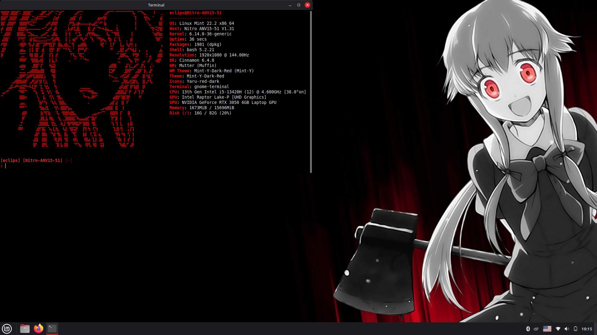
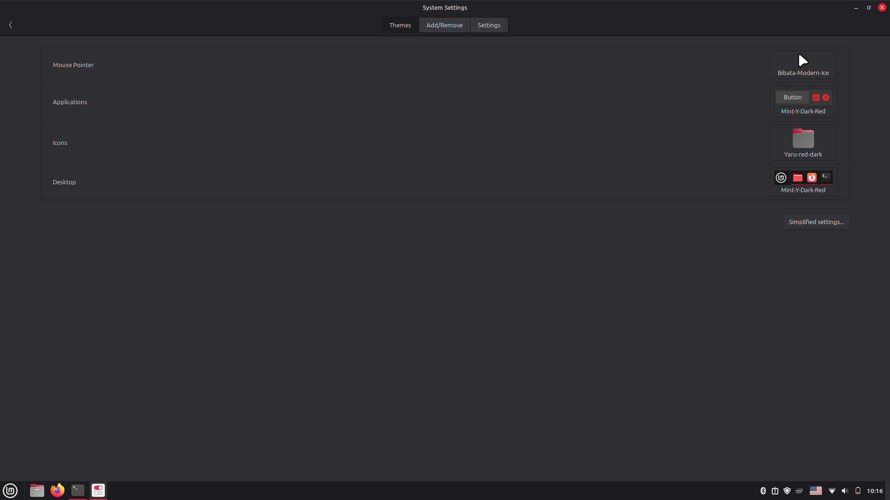

#Linux MInt Cinnamon Theme

## Quick Install

1. Install Starship  

	curl -sS https://starship.rs/install.sh | sh
	echo 'eval "$(starship init bash)"' >> ~/.bashrc

2. Drop the configs

	cp starship.toml ~/.config/
	cp config.conf ~/.config/neofetch/config.conf

3. Reload & check

	exec bash
	neofetch

Powered with AI and was protected by MIT License
